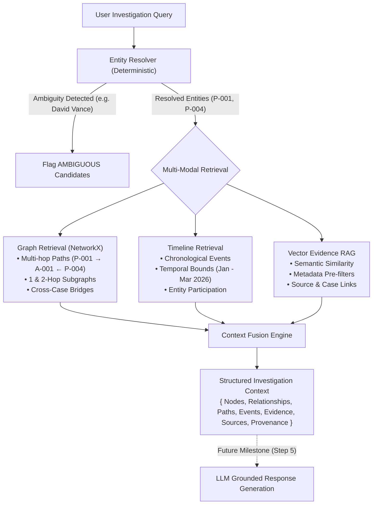

# Graph-RAG & Context Fusion Architecture

**Platform:** Network Hunter (PS09 — "The Network Hunter")  
**Module:** Step 4 — Graph-RAG + Context Fusion

---

## 1. Overview

The **Graph-RAG** layer in Network Hunter fuses three distinct retrieval modalities into a single, structured, provenance-preserving investigation context without fabricating facts or guessing ambiguous identities.



---

## 2. The Three Retrieval Modalities

### 1. Structured Knowledge Graph Retrieval
- **Technology:** Relational SQLAlchemy Schema + NetworkX in-memory Graph.
- **Path Discovery:** Finds up to 2-hop traversals connecting two entities (e.g., `P-001 (Marcus Vance) --[ASSOCIATED_WITH]--> A-001 (CHASE-CORP-9482) <--[ASSOCIATED_WITH]-- P-004 (Julian Thorne)`).
- **Cross-Case Detection:** Identifies bridge operatives (e.g., `P-004`) spanning across multiple independent cases (`CASE-001` and `CASE-002`).

### 2. Chronological Timeline & Event Retrieval
- **Sorting:** Strict chronological timestamp ordering.
- **Filtering:** Case-specific isolation and temporal window bounds (e.g., `2026-01-01` to `2026-03-31`).
- **Entity Roles:** Captures participant roles (e.g. `CALLER`, `RECEIVER`, `ATTENDEE`, `AUTHORIZER`).

### 3. Vector Evidence Retrieval
- **Semantic Search:** Cosine similarity over enriched evidence documents.
- **Metadata Filters:** Case ID, Entity ID, Source Type, Verification Status, Date Bounds.
- **Status Preservation:** Retains critical investigative nuances like `CONTRADICTED` and `AMBIGUOUS`.

---

## 3. Context Fusion Data Contract

Endpoint: `POST /api/v1/investigation/retrieve`

```json
{
  "query": "What connects Marcus Vance and Julian Thorne?",
  "case_id": "CASE-001",
  "resolved_entities": [
    { "id": "P-001", "name": "Marcus Vance", "entity_type": "PERSON" },
    { "id": "P-004", "name": "Julian Thorne", "entity_type": "PERSON" }
  ],
  "ambiguities": [],
  "graph_context": {
    "nodes": [...],
    "relationships": [...],
    "paths": [
      {
        "source_id": "P-001",
        "target_id": "P-004",
        "hops": 2,
        "path_summary": "P-001 (Marcus Vance) -[ASSOCIATED_WITH]-> A-001 (CHASE-CORP-9482) -[ASSOCIATED_WITH]-> P-004 (Julian Thorne)"
      }
    ]
  },
  "timeline_context": {
    "total_events": 9,
    "events": [...]
  },
  "evidence_context": {
    "total_results": 10,
    "results": [...]
  },
  "sources": [...],
  "provenance": [
    {
      "evidence_id": "EVD-005",
      "source_id": "SRC-011",
      "source_reference": "FIN-CHASE-SIG-A001",
      "verification_status": "VERIFIED",
      "provenance_path": "Evidence [EVD-005] (BANK_MANDATE, VERIFIED) → Source [SRC-011] (FIN-CHASE-SIG-A001) → Case [NH-2026-001]"
    }
  ]
}
```

---

## 4. Safety & Trust Rules

1. **No Automatic Entity Merging:** Duplicate names (like "David Vance" `P-002` and `P-011`) return `status = "AMBIGUOUS"` with candidate options.
2. **Contradiction Preservation:** Contradicted evidence (`EVD-017`) explicitly preserves `verification_status = "CONTRADICTED"`.
3. **Traceable Provenance:** Every graph edge and vector hit links directly to its parent `Source` and `Case`.
