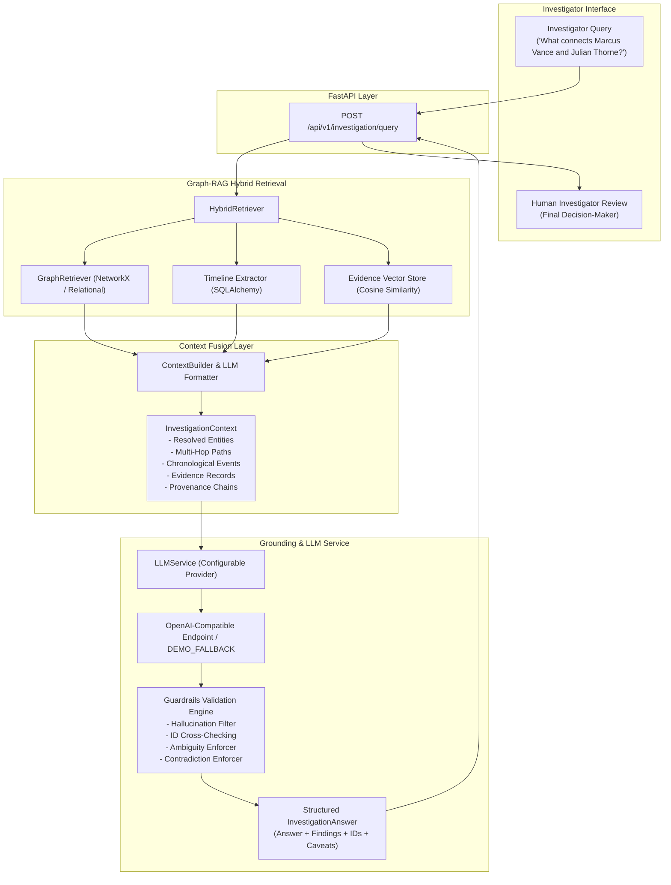

# Grounded LLM Investigation Assistant (Step 5)

## 1. Overview & Core Philosophy

Network Hunter's **Grounded LLM Generation Layer** operates strictly on top of the hybrid Graph-RAG retrieval pipeline. The LLM acts exclusively as an analytical explanation engine for retrieved relational networks, chronological timelines, and vector evidence documents. It **never** performs unconstrained searches, **never** invents identifiers, and **never** makes autonomous legal conclusions.

### Core Division of Responsibility

| Component | Responsibility | Question Answered |
| :--- | :--- | :--- |
| **Knowledge Graph** | Entities, Associations, Multi-Hop Paths, Bridge Accounts | **WHAT** connects the targets? |
| **Timeline Engine** | Chronological Event Sequence & Milestones | **WHEN** did activities occur? |
| **Evidence Vector Store** | Verified & Observed Investigative Documents | **WHERE** is the documented proof? |
| **Grounded LLM** | Synthesis, Attribution, Citation, and Human-Readable Explanation | **EXPLAIN** the retrieved context |

> **Key Architectural Principle:**
> *"Network Hunter uses Graph-RAG to retrieve the investigative structure and evidence, then uses an LLM only to explain the retrieved context."*

---

## 2. End-to-End Architecture



---

## 3. Strict Grounding Guardrails

The LLM grounding layer implements programmatic safeguards in `backend/app/llm/guardrails.py`:

1. **Zero-Hallucination ID Verification**:
   - Every `evidence_id`, `source_id`, `relationship_id`, and `entity_id` cited by the model is validated against the retrieved `InvestigationContext`.
   - Any hallucinated IDs are stripped and flagged with explicit guardrail warnings.
2. **Ambiguity Preservation**:
   - When an entity query is ambiguous (e.g. `David Vance` matching `P-002` and `P-011`), the resolver marks the query `AMBIGUOUS`. The LLM is prohibited from selecting a candidate arbitrarily.
   - The response produces an `AMBIGUOUS` finding and sets `requires_human_review = True`.
3. **Contradiction Preservation**:
   - If evidence records contain `verification_status == "CONTRADICTED"` (e.g. `EVD-017`), the model explicitly flags that the statement is refuted and cannot be treated as fact.
4. **No Autonomous Guilt Determinations**:
   - The system prompt forbids claims that relationships "prove guilt" or "constitute illegal conduct".
   - Graph centrality does not imply culpability.
5. **Prompt Injection Defense**:
   - Evidence document texts are treated strictly as data blocks. Embedded instructions (e.g., *"ignore previous instructions"*) are sanitized and neutralized.

---

## 4. API Specification

### `POST /api/v1/investigation/query`

#### Request Payload
```json
{
  "query": "What connects Marcus Vance and Julian Thorne?",
  "case_id": "CASE-001",
  "top_k": 5
}
```

#### Response Payload
```json
{
  "query": "What connects Marcus Vance and Julian Thorne?",
  "mode": "DEMO_FALLBACK",
  "answer": "Records indicate a network path connection: Marcus Vance (P-001) -> Account A-001 (A-001) -> Julian Thorne (P-004)...",
  "findings": [
    {
      "statement": "Discovered 2-hop graph connection: Marcus Vance (P-001) -> Account A-001 (A-001) -> Julian Thorne (P-004). Connection traverses shared financial/asset entity Account A-001 (A-001).",
      "finding_type": "VERIFIED",
      "evidence_ids": ["EVD-005"],
      "source_ids": ["SRC-011"],
      "relationship_ids": ["REL-001", "REL-002"],
      "confidence_label": "HIGH"
    }
  ],
  "source_ids": ["SRC-001", "SRC-002", "SRC-004", "SRC-011"],
  "evidence_ids": ["EVD-002", "EVD-003", "EVD-005"],
  "relationship_ids": ["REL-001", "REL-002"],
  "entity_ids": ["A-001", "P-001", "P-004"],
  "caveats": [
    "Generated via deterministic development fallback mode (DEMO_FALLBACK).",
    "Records indicate investigative connections; human review is required before drawing legal conclusions."
  ],
  "requires_human_review": true
}
```

---

## 5. Security & Data Governance

- **Synthetic Data Disclaimer**: All investigation cases (`CASE-001`, `CASE-002`), entities, relationships, evidence records, and sources are synthetic demonstration records for Smart India Hackathon (SIH) PS09.
- **Production Data Isolation**: In an operational law enforcement or financial intelligence environment, real case data must never be transmitted to public LLM endpoints without authorized air-gapped or private enterprise model deployments.
- **Audit Logging**: Every query, retrieved context footprint, cited ID list, and validation check is logged with structured telemetry (`[LLM]` log prefix) without exposing raw API keys or sensitive investigator credentials.
- **Human-in-the-Loop Mandate**: AI-generated analytical summaries are advisory only. Certified human investigators remain the ultimate decision-makers.
